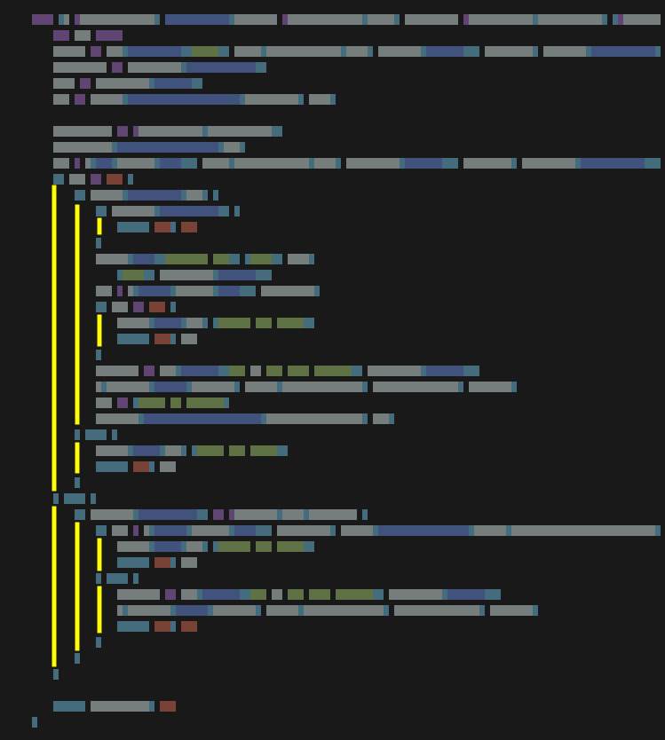
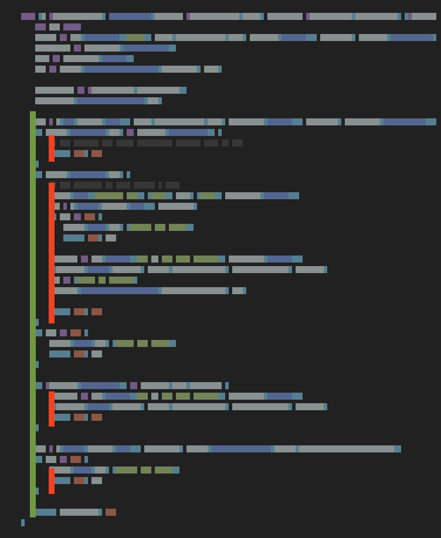

Readability is a property we all love about Go. In other languages, it might be fine to have a lot of nested if statements; in Go, it is a good practice to keep away from overly-nested logic. One of the [Go proverbs](https://www.reddit.com/r/ProgrammerTIL/comments/acweob/go_til_a_new_go_proverb_the_happy_path_is/) says:

> The happy path is left-aligned.

In this post, I attempt to show through two examples what we mean by "left-aligned happy path" and what are the benefits in terms of readibility and maintainability.

## Simple example

Let's see a quick example of what we mean by "happy path is left-aligned". The following snippet has two nested ifs. That would be the standard idiom for any language like Java:

```go
if authorizationHeader != "" {
    // nested happy path
    if len(bearerToken) != 2 {
        // even more nested happy path
    }
    // error handling here
}
// error handling here
```

We see two things happening here:

- nesting `if`s increases the cognitive weight; we have to think in order to understand what the logic does.
- nesting ifs often encourages the use of "fallthroughs" (reusing the same code path for two different cases). It tends to obfuscate how and where the function fails and returns.

If we move the first `if` to its own "guard statement", then we end up with less nesting which translates to code easier to parse (parse as a human):

```go
if authorizationHeader == "" {
    // unhappy path, error handling here
    return
}

// happy path always stays (or almost always) unnested
if len(bearerToken) != 2 {
    // unhappy path, error handling here
    return
}
```

Notice how each code path is obvious. Parsing the code is fast and you have less chance of misunderstanding the logic.

<!--

## Business logic guards vs. data verification guards

In the chapter "[Introducing Guard
Clauses](https://www.pluralsight.com/courses/advanced-defensive-programming-techniques)"
(pluralsight course), it says you should fail fast with guard clauses.
That's pretty much what the left-aligned happy path idiom does. The author
adds something interesting: we should avoid mixing the "business logic
guards" with the "data verification (nil, err...) guards". It makes sense
because it's easy to mix things and loose where the business logic is.
Further on that: [Go Verifier
library](https://itnext.io/clear-defensive-programming-with-go-using-verifier-library-6f648810b453).

-->

<!--
## How does it fit with Defensive programming?

defensive programming = logic must be nested in ifs so that it is protected and is only run when all if checks are OK

You can write a program with the "deeply-nested ifs" and later change it to
be "left-aligned with guard clauses". Both ways are very similar, it is
just a different "style".

Changing from one to the other will not make your code "more defensive" or
"less defensive" in the sense that these two styles are just styles and do
not prescribe a specific way of writing things like the input verification.
-->

## Real example

While perusing how other Kubernetes developers are implementing their own reconciliation loop, I came across [an interesting piece of code](https://github.com/kubeflow/katib/blob/40f55b41c/pkg/controller.v1alpha3/trial/trial_controller.go#L259-L291).

The author decided to use the `if-else` control flow at its maximum potential: the logic goes as deep as three tabs to the right. We cannot immediately guess which parts are important and which aren't.

```go
func (r *ReconcileTrial) reconcileJob(instance *trialsv1alpha3.Trial, desiredJob *unstructured.Unstructured) (*unstructured.Unstructured, error) {
    var err error
    logger := log.WithValues("Trial", types.NamespacedName{Name: instance.GetName(), Namespace: instance.GetNamespace()})
    apiVersion := desiredJob.GetAPIVersion()
    kind := desiredJob.GetKind()
    gvk := schema.FromAPIVersionAndKind(apiVersion, kind)

    deployedJob := &unstructured.Unstructured{}
    deployedJob.SetGroupVersionKind(gvk)
    err = r.Get(context.TODO(), types.NamespacedName{Name: desiredJob.GetName(), Namespace: desiredJob.GetNamespace()}, deployedJob)
    if err != nil {
        if errors.IsNotFound(err) {
            if instance.IsCompleted() {
                return nil, nil
            }
            logger.Info("Creating Job", "kind", kind,
                "name", desiredJob.GetName())
            err = r.Create(context.TODO(), desiredJob)
            if err != nil {
                logger.Error(err, "Create job error")
                return nil, err
            }
            eventMsg := fmt.Sprintf("Job %s has been created", desiredJob.GetName())
            r.recorder.Eventf(instance, corev1.EventTypeNormal, JobCreatedReason, eventMsg)
            msg := "Trial is running"
            instance.MarkTrialStatusRunning(TrialRunningReason, msg)
        } else {
            logger.Error(err, "Trial Get error")
            return nil, err
        }
    } else {
        if instance.IsCompleted() && !instance.Spec.RetainRun {
            if err = r.Delete(context.TODO(), desiredJob, client.PropagationPolicy(metav1.DeletePropagationForeground)); err != nil {
                logger.Error(err, "Delete job error")
                return nil, err
            } else {
                eventMsg := fmt.Sprintf("Job %s has been deleted", desiredJob.GetName())
                r.recorder.Eventf(instance, corev1.EventTypeNormal, JobDeletedReason, eventMsg)
                return nil, nil
            }
        }
    }

    return deployedJob, nil
}
```

The outline of this function doesn't tell us anything about what the flow is and where the important logic is. Having deeply nested `if-else` statements hurt Go's glanceability: where is the "happy path"? Where are the "error paths"?



By refactoring and removing `else` statements, we obtain a more coherent aligned-to-the-left path:



The green line represents the "core logic" and is at the minimum indentation level. The red line represents anything out of the ordinary: error handling and guards.

And since our eyes are very good at following lines, the _line of sight_ (the green line) guides us and greatly improves the experience of glancing at a piece of code.

Here is the actual code I rewrote:

```go
func (r *ReconcileTrial) reconcileJob(instance *trialsv1alpha3.Trial, desiredJob *unstructured.Unstructured) (*unstructured.Unstructured, error) {
    var err error
    logger := log.WithValues("Trial", types.NamespacedName{Name: instance.GetName(), Namespace: instance.GetNamespace()})
    apiVersion := desiredJob.GetAPIVersion()
    kind := desiredJob.GetKind()
    gvk := schema.FromAPIVersionAndKind(apiVersion, kind)

    deployedJob := &unstructured.Unstructured{}
    deployedJob.SetGroupVersionKind(gvk)

    err = r.Get(context.TODO(), types.NamespacedName{Name: desiredJob.GetName(), Namespace: desiredJob.GetNamespace()}, deployedJob)
    switch {
    case errors.IsNotFound(err) && instance.IsCompleted():
        // Job deleted and trial completed, nothing left to do.
        return nil, nil
    case errors.IsNotFound(err):
        // Job deleted, we must create a job.
        logger.Info("Creating Job", "kind", kind, "name", desiredJob.GetName())
        err = r.Create(context.TODO(), desiredJob)
        if err != nil {
            logger.Error(err, "Create job error")
            return nil, err
        }
        eventMsg := fmt.Sprintf("Job %s has been created", desiredJob.GetName())
        r.recorder.Eventf(instance, corev1.EventTypeNormal, JobCreatedReason, eventMsg)
        msg := "Trial is running"
        instance.MarkTrialStatusRunning(TrialRunningReason, msg)

        return nil, nil
    case err != nil:
        logger.Error(err, "Trial Get error")
        return nil, err
    }

    if !instance.IsCompleted() || instance.Spec.RetainRun {
        eventMsg := fmt.Sprintf("Job %s has been deleted", desiredJob.GetName())
        r.recorder.Eventf(instance, corev1.EventTypeNormal, JobDeletedReason, eventMsg)
        return nil, nil
    }

    err = r.Delete(context.TODO(), desiredJob, client.PropagationPolicy(metav1.DeletePropagationForeground))
    if err != nil {
        logger.Error(err, "Delete job error")
        return nil, err
    }

    return deployedJob, nil
}
```

You can also take a look at Matt Ryer's _Idiomatic Go Tricks_ ([blog post](https://medium.com/@matryer/line-of-sight-in-code-186dd7cdea88)) where he presents some ways of keeping your code as readable as possible:



**Update 23 April 2020:** added a proper introduction with a simple example.

---

<!--
Wish to comment? Here is the Twitter thread for that post:


-->
