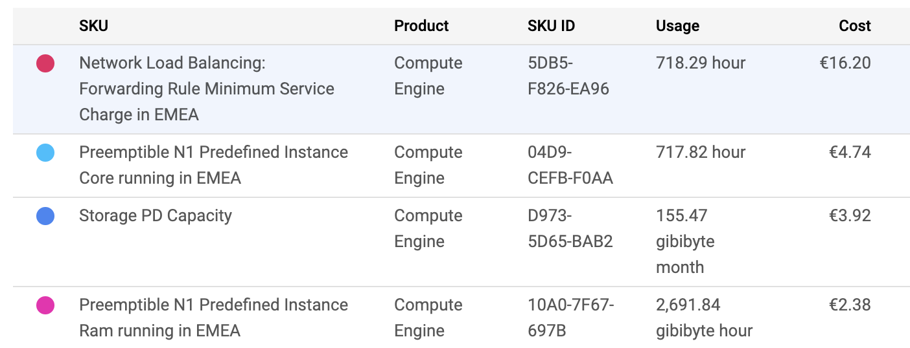
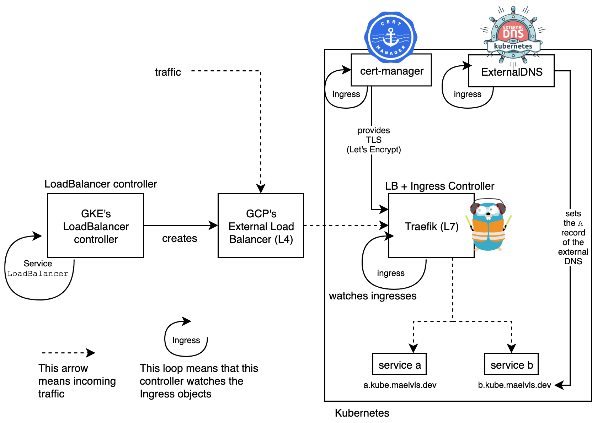
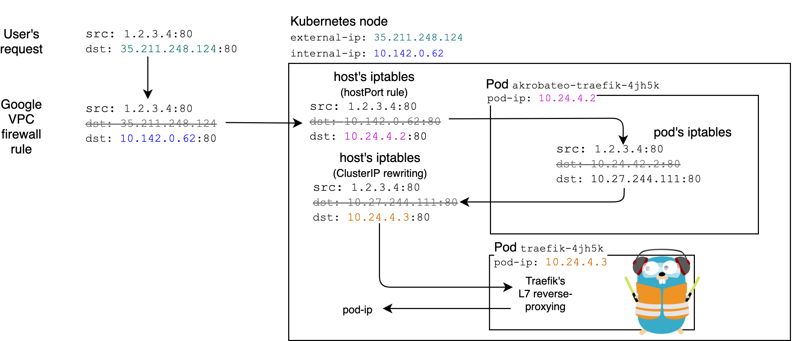

I like being able to keep my own GKE Kubernetes cluster for experimenting.
But I realized that this _Network Load Balancer_ was way too expensive.



What happens is that GKE has a LoadBalancer controller running (I can't see
it) and whenever I have a service with `type: LoadBalancer`, it will create
a L4 load balancer that balances 80 and 443 traffic across the nodes. Here
is a diagram of my current setup:



I use Traefik as a reverse-proxy and terminates the end-user TLS
connection. And since Traefik sets the `status.loadBalancer.ingress` on the
ingress objects, I can also use
[ExternalDNS](https://github.com/kubernetes-sigs/external-dns/) for setting
the `A` records automatically (I use Cloud DNS).

What if I stopped using the LoadBalancer service and use a `NodePort` instead? Two reasons against that:

1. GKE [restricts](https://issues.k8s.io/9995) the ports you can use to
   30000 and above. So I would end up with `https://kube.maelvls.dev:30145`
   and I definitely don't want that. I want to use 80 and 443.
2. Traefik uses the LoadBalancer service's status in order to set the
   ingresses' `status.loadBalancer.ingress`, which in turn is used by
   ExternalDNS for setting the `A` records automatically. I still want to
   be able to use ExternalDNS.

Thus, my goal is expose Traefik on 80 and 443 and still use the `type:
LoadBalancer` which, in turn, allows me to use ExternalDNS.

I could use the service's `externalIPs` but it isn't supported by Traefik
and I would have to write some controller that would get the node internal
IP and then set the `externalIPs` with these.

Instead, I opted for the `hostPort` solution. No restriction on 80 or 443.
But I still have to automate a lot. Fortunately,
[akrobateo](https://github.com/kontena/akrobateo) does exactly what I need.

Akrobateo acts as an internal LoadBalancer service controller and replaces
the gce-ingress-controller that GKE applies to every GKE cluster. It is
inspired by K3S'
[servicelb](https://github.com/rancher/k3s/blob/341a5553/pkg/servicelb/controller.go).

The akrobateo controller reads the LoadBalancer services and updates the
`status.loadBalancer.ingress` on these services with the node external IPs.
Whenever the external IPs change (since they are ephemeral), the controller
updates the service; Traefik does it job and finally ExternalDNS updates
the DNS records.

I might get some downtime with that, but for my use it's just fine.

## Setting up Akrobateo

That will install the akrobateo controller in the kube-system namespace:

```sh
k apply -k https://github.com/kontena/akrobateo/deploy
```

Since we want TCP 80 and 443 traffic to be able to hit the nodes. Let's set
a new firewall rule:

```sh
gcloud compute firewall-rules create akrobateo-fw-traefik --allow tcp:80,tcp:443 --source-ranges=0.0.0.0/0
```

Also, make sure we don't have a L4 load balancer still running. The load
balancer won't get removed automatically.

```sh
% gcloud compute forwarding-rules list
Listed 0 items.
```

At this point, the LoadBalancer service should contain the IPs of the nodes:

```sh
% k -n traefik get services traefik -oyaml
apiVersion: v1
kind: Service
metadata:
  name: traefik
  namespace: traefik
spec:
  clusterIP: 10.27.244.111
  externalTrafficPolicy: Cluster
  ports:
  - name: http
    nodePort: 30371
    port: 80
    protocol: TCP
    targetPort: http
  - name: https
    nodePort: 32748
    port: 443
    protocol: TCP
    targetPort: https
  type: LoadBalancer
status:
  loadBalancer:
    ingress:
    - ip: 35.211.248.124
    - ip: 35.231.10.40


% k -n traefik get services -owide
NAME                TYPE           CLUSTER-IP      EXTERNAL-IP                   PORT(S)
traefik             LoadBalancer   10.27.244.111   35.211.248.124,35.231.10.40   80:30371/TCP,443:32748/TCP
```

Let's check that these are the external IPs of the cluster nodes:

```sh
% k get nodes -owide
NAME                                                 INTERNAL-IP   EXTERNAL-IP
gke-august-period-234610-worker-0c5c84f5-rq25        10.142.0.61   35.231.10.40
gke-august-period-234610-worker-micro-cf12d79d-klh6  10.142.0.62   35.211.248.124
```

The `kube-system/akrobateo` controller will create a DeamonSet for every
LoadBalancer service it finds. The DeamonSet is created in the same
namespace as where the Service is:

```sh
% k get ds -A
NAMESPACE     NAME                       DESIRED   CURRENT   READY   UP-TO-DATE   AVAILABLE
traefik       akrobateo-traefik          2         2         2       2            2
```

This DeamonSet runs one pod per node, each pod being responsible for
proxying everything coming to the host's 80 and 443 ports to Traefik (see
description of the network flow below).

Let's make sure ExternalDNS uses the correct IPs:

```sh
k -n external-dns logs -l app.kubernetes.io/name=external-dns -f
time="2020-01-18T17:26:31Z" level=debug msg="Endpoints generated from ingress: traefik/traefik-dashboard: [traefik.kube.maelvls.dev 0 IN A  35.211.248.124 [] traefik.kube.maelvls.dev 0 IN A  35.211.248.124 []]"
```

There still is a slight issue here: we would expect ExternalDNS to set a
`A` record with both IPs (35.211.248.124 and 35.231.10.40). But for some
reason, it doesn't. As we have seen previously, the Akrobateo controller
has successfully updated the traefik/traefik service (type LoadBalancer).
And since Traefik is the ingress controller responsible for setting the
`status.loadBalancer.ingress` on ingresses, Traefik is probably the culprit
and might simply pick the first element.

## Pros and cons

- **What about security, isn't `hostPort` a bad practice?** I don't know
  enough yet and cannot really tell.
- **What if I have many more nodes, can it scale?** I don't know.
- **Reliability?** If the nodes that are advertised in the `A` DNS records
  go down, no more ingress traffic possible.
- **What if the node's external-ip changes?** Since these IPs are
  ephemeral, the controller will pick up this change and change the
  `status.loadBalancer.ingress` field of my `type: LoadBalancer` service.

## How does it work?

Since I created a firewall rule for 80 and 443, GCE forwards the traffic
from 35.211.248.124 (the node's external-ip) to 10.142.0.62 (the node's
internal-ip). And since we use `hostPort`, kubelet creates some iptable
rules that redirect traffic to the pod running on that node:

```sh
% gcloud compute ssh gke-august-period-234610-worker-micro-cf12d79d-klh6 --command='sudo iptables-save' | egrep "(HOSTPORT|HP)"
-A PREROUTING -m comment --comment "kube hostport portals" -m addrtype --dst-type LOCAL -j KUBE-HOSTPORTS
-A OUTPUT -m comment --comment "kube hostport portals" -m addrtype --dst-type LOCAL -j KUBE-HOSTPORTS
-A PREROUTING -m comment --comment "kube hostport portals" -m addrtype --dst-type LOCAL -j KUBE-HOSTPORTS
    # If the packet destination is local (localhost or 127.*), continue with KUBE-HOSTPORTS.
-A KUBE-HOSTPORTS -p tcp -m comment --comment "akrobateo-traefik-4jh5k_traefik hostport 443" -m tcp --dport 443 -j KUBE-HP-A7HWACIJNU4N3R5W
    # If it is a TCP packet and the destication port is 443, continue with KUBE-HP-A7HWACIJNU4N3R5W
-A KUBE-HP-A7HWACIJNU4N3R5W -s 10.24.4.2/32 -m comment --comment "akrobateo-traefik-4jh5k_traefik hostport 443" -j KUBE-MARK-MASQ
    # If the source IP of the packet is the akrobateo proxy pod, this packet is egressing: continue with KUBE-MARK-MASQ (masquarade)
-A KUBE-HP-A7HWACIJNU4N3R5W -p tcp -m comment --comment "akrobateo-traefik-4jh5k_traefik hostport 443" -m tcp -j DNAT --to-destination 10.24.4.2:443
    # If the source wasnt this pod, then we assume it is some ingress. We replace the destination with the pods ClusterIP.
```

Then, when it is in the pod, the pod's iptables will kick in and redirect.
Nothing is actually running in the pod, except for the namespaced network
stack. These pods have:

- an init container that runs `sysctl -w net.ipv4.ip_forward=1` (see
  [k8s-networking-gce][]) in privileged mode, which enables forwarding
  inside the pod (does not affect the host).
- two containers set iptables and then `pause`. In order to alter its
  namespaced TCP stack, we give the containers the NET_ADMIN capability
  (these rules only affect the pod, not the host).

  ```sh
  sudo iptables -t nat -I PREROUTING ! -s 10.27.244.111/32 -p TCP --dport 80 -j DNAT --to 10.27.244.111:80
  sudo iptables -t nat -I POSTROUTING -d 10.27.244.111/32 -p TCP -j MASQUERADE
  sudo iptables -t nat -I PREROUTING ! -s 10.27.244.111/32 -p TCP --dport 443 -j DNAT --to 10.27.244.111:443
  sudo iptables -t nat -I POSTROUTING -d 10.27.244.111/32 -p TCP -j MASQUERADE
  ```

[k8s-networking-gce]: https://kubernetes.io/docs/concepts/cluster-administration/networking/#google-compute-engine-gce

Here is a diagram that shows the whole picture:



## Recap

- Akrobateo is a controller that watches Services of `type: LoadBalancer`
- When it finds one, creates a deamonset of empty pods
- The task of these empty pods is to set one iptable rule that redirects
  traffic to the ClusterIP of the `type: LoadBalancer` service
- Akrobateo also sets the Service's status with the loadBalancer IP.
- Benefit: since the loadBalancer IP is properly set, ExternalDNS works.

---

Want to drop a comment? Here is a Twitter thread:


