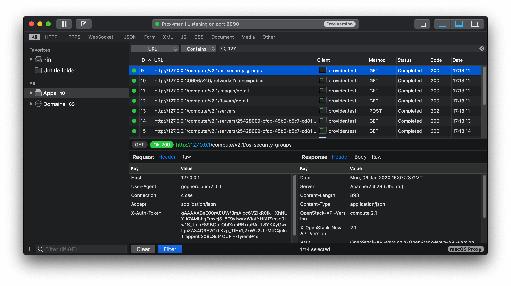

I use [Proxyman](https://proxyman.io) for inspecting the HTTP and HTTPS
traffic coming from applications. For example, you may want to know which
API calls are made by `docker` when running `docker search`. What I would
do is

```sh
HTTPS_PROXY=http://localhost:9090 docker search ubuntu
```

Since Proxyman acts like a proxy listening on 0.0.0.0:9090, I can see and
replay all the HTTP calls, similarly to what you would do with the Chrome
DevTools.



Note that HTTPS is a bit tricky and requires an additional step on macOS
(settings > Proxyman CA > Generate new) but works flawlessly with any Go
binary since Go supports `HTTPS_PROXY` by default. For Python, it becomes a
bit trickier often requires the app to have a flag like `--cacert`.

But by default, Go [ignores `HTTPS_PROXY`] for `localhost` and `127.0.0.1` hosts (see [ProxyFunc](https://godoc.org/golang.org/x/net/http/httpproxy#Config.ProxyFunc) and [useProxy](https://github.com/golang/net/blob/c0dbc17a35534bf2e581d7a942408dc936316da4/http/httpproxy/proxy.go#L172-L191)):

> As a special case, if req.URL.Host is "localhost" (with or without a port
> number), then a nil URL and nil error will be returned.

Note that the documentation forgets to mention that `127.0.0.1` (and
related) are also ignored. That's a bummer since using a proxy may be the
only way to debug a CLI or an application that makes network calls without
logging properly.

Two solutions: either you have access (and are willing to) hack the source
code in order to force Go to use the proxy with `localhost` anyway, or you
can hack your `/etc/hosts` and use a different host.

## Solution 1: hack the proxy setup by tweaking `http.Transport`

You need to have access to the place where the `http.Client` is set. Imagine that you are working on something that uses the Openstack API. You would have something like:

```go
package main

import (
	"fmt"
	"os"

	"github.com/gophercloud/gophercloud"
	"github.com/gophercloud/gophercloud/openstack"
	"github.com/gophercloud/gophercloud/openstack/compute/v2/servers"
)

func main() {
	pr, err := openstack.NewClient("http://localhost/identity/v3")
	if err != nil {
		fmt.Fprintf(os.Stderr, "could not create an openstack client")
		os.Exit(1)
	}

	err = openstack.Authenticate(pr, gophercloud.AuthOptions{
		IdentityEndpoint: "http://localhost/identity/v3",
		DomainName:       "Default",
		Username:         "admin",
		Password:         "secret",
		TenantName:       "admin",
	})
	if err != nil {
		fmt.Fprintf(os.Stderr, "auth failed")
		os.Exit(1)
	}

	compute, err := openstack.NewComputeV2(pr, gophercloud.EndpointOpts{Region: ""})
	srvs, err := servers.List(compute, nil).AllPages()
	if err != nil {
		fmt.Fprintf(os.Stderr, "%v\n", err)
		os.Exit(1)
	}

	fmt.Printf("servers:\n%v\n", srvs)
}
```

We must be able to swap the `http.Transport` used. The [`http.DefaultTransport`](https://golang.org/src/net/http/transport.go#L42) uses `ProxyFromEnvironment`:

```go
// DefaultTransport is the default implementation of Transport and is
// used by DefaultClient. It establishes network connections as needed
// and caches them for reuse by subsequent calls. It uses HTTP proxies
// as directed by the $HTTP_PROXY and $NO_PROXY (or $http_proxy and
// $no_proxy) environment variables.
var DefaultTransport RoundTripper = &Transport{
	Proxy: ProxyFromEnvironment,
	DialContext: (&net.Dialer{
		Timeout:   30 * time.Second,
		KeepAlive: 30 * time.Second,
		DualStack: true,
	}).DialContext,
	ForceAttemptHTTP2:     true,
	MaxIdleConns:          100,
	IdleConnTimeout:       90 * time.Second,
	TLSHandshakeTimeout:   10 * time.Second,
	ExpectContinueTimeout: 1 * time.Second,
}
```

Let's change `ProxyFromEnvironment` with something of our own:

```go
Proxy: func(req *http.Request) (*url.URL, error) {
    return url.Parse("http://127.0.0.1:9090")
},
```

Now, the code looks like this:

```go
package main

import (
	"fmt"
	"net"
	"net/http"
	"net/url"
	"os"
	"time"

	"github.com/gophercloud/gophercloud"
	"github.com/gophercloud/gophercloud/openstack"
	"github.com/gophercloud/gophercloud/openstack/compute/v2/servers"
)

func main() {
	pr, err := openstack.NewClient("http://localhost/identity/v3")
	if err != nil {
		fmt.Fprintf(os.Stderr, "could not create an openstack client")
		os.Exit(1)
	}
	pr.HTTPClient.Transport = &http.Transport{
		Proxy: func(req *http.Request) (*url.URL, error) {
			return url.Parse("http://127.0.0.1:9090")
		},
		DialContext: (&net.Dialer{
			Timeout:   30 * time.Second,
			KeepAlive: 30 * time.Second,
			DualStack: true,
		}).DialContext,
		ForceAttemptHTTP2:     true,
		MaxIdleConns:          100,
		IdleConnTimeout:       90 * time.Second,
		TLSHandshakeTimeout:   10 * time.Second,
		ExpectContinueTimeout: 1 * time.Second,
	}

	err = openstack.Authenticate(pr, gophercloud.AuthOptions{
		IdentityEndpoint: "http://localhost/identity/v3",
		DomainName:       "Default",
		Username:         "admin",
		Password:         "secret",
		TenantName:       "admin",
	})
	if err != nil {
		fmt.Fprintf(os.Stderr, "auth failed")
		os.Exit(1)
	}

	compute, err := openstack.NewComputeV2(pr, gophercloud.EndpointOpts{Region: ""})
	srvs, err := servers.List(compute, nil).AllPages()
	if err != nil {
		fmt.Fprintf(os.Stderr, "%v\n", err)
		os.Exit(1)
	}

	fmt.Printf("servers:\n%v\n", srvs)
}
```

Now, all traffic including calls to `Host: localhost` or `Host: 127.0.0.1`
will be properly proxied to `localhost:9090`.

## Solution 2: use a different host name

In your `/etc/hosts`, add the line such as `local 127.0.0.1`. Now, you can
use the host `local` instead of `localhost`, which means Go will proxy your
requests properly.

---

Join the discussion on Twitter:


