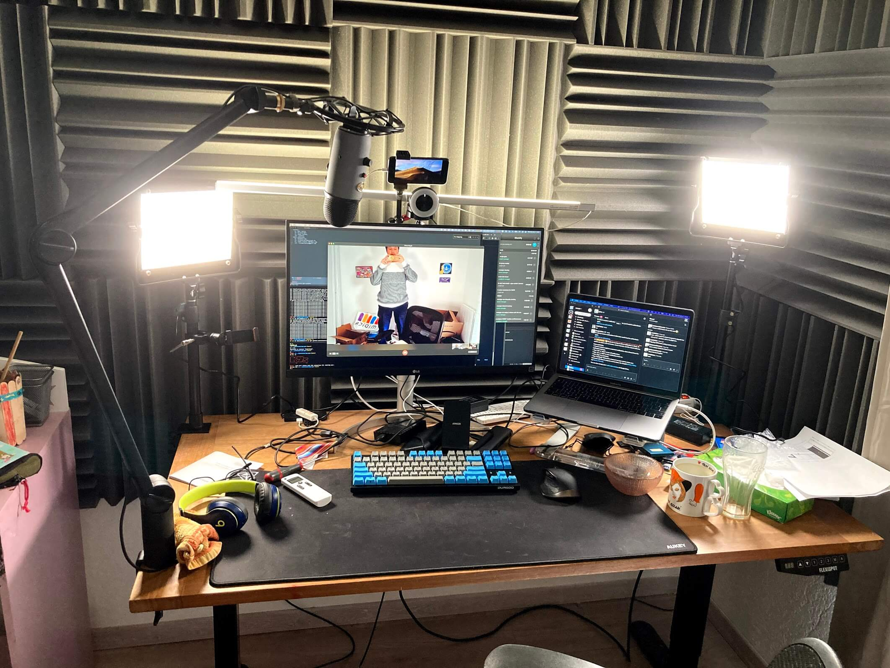
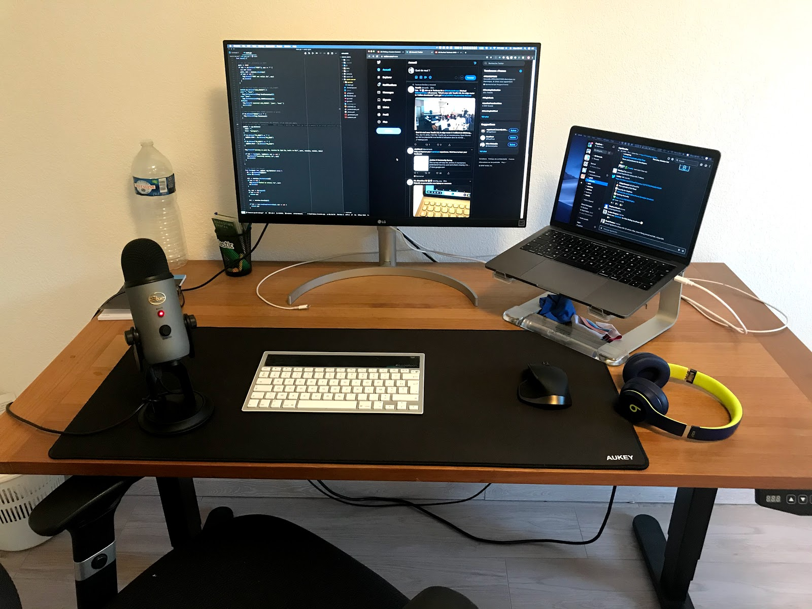

In this post, I document the changes to my office setup through time.

## 2021 Update

- I switched from the Apple Magic AZERTY keyboard to a QWERTY mechanical keyboard: the [Durgod Taurus K320 TKL](https://www.amazon.com/DURGOD-Mechanical-Interface-Tenkeyless-Anti-Ghosting/dp/B07B8J6C3C). I chose the Cherry MX Brown switches, and I love them. It feels so much better to be typing on this keyboard. Moving from AZERTY to QWERTY was the hardest part. It took about 3 months to get as confortable as I was using the AZERTY layout. I really wanted to stop working on a "second class" keyboard layout that has poor shortcut support on most apps. The other adjustment I had to do was to go to the macOS settings and swap the <kbd>Windows</kbd> key with the <kbd>Alt</kbd> key so that the <kbd>⌘</kbd> and <kbd/>⌥</kbd> keys are at in the right order.
- Two [UTEBIT articulating arms](https://www.amazon.com/UTEBIT-Upgraded-Articulating-Friction-Adjustable/dp/B07H77KB7R/ref=sr_1_6?dchild=1&keywords=UTEBIT+Desk+Mount+Metal+Tabletop+Light+Stand+Adjustable&qid=1615567111&sr=8-6) that hold (1) an old iPhone 7 that I use as a secondary screen using Duet and (2) a Razer Kiyo camera.
- A [Razer Kiyo](https://www.razer.com/streaming-cameras/razer-kiyo) camera (USB 3). I wish I had a proper DSLR camera though: the Kiyo needs a ton of light to have a good image quality.
- Two [UTEBIT tabletop arms](https://www.amazon.com/UTEBIT-Shooting-Adjustable-Aluminum-Tabletop/dp/B08PYY95LJ/ref=sr_1_3?dchild=1&keywords=UTEBIT+Desk+Mount+Metal+Tabletop+Light+Stand+Adjustable&qid=1615567111&sr=8-3) that I use to hold the flood lights.
- Two [NEEWER bi-color 660 flood lights](https://www.amazon.com/Neewer-Pieces-Bi-color-Video-Light/dp/B06XW3B81V).
- A set of UTEBIT 1/4 to 3/8 screw adapters.

## 2020 Update

- [Yeti Compass](https://www.bluedesigns.com/products/compass) boom arm
  > Note that the boom arm is meant to carry the shock mount + the mic and since I only mounted the Yeti mic, the spring mechanism is a bit too tight which means the arm tends to go up. I unscrewed the screw in the base of the boom arm at its minimum but the tension is still too high and the boom arm tends to go up.
- Apple Magic Keyboard. I also use a [Sharkoon PureWriter TKL](https://fr.sharkoon.com/product/PureWriter%20TKL) from time to time when I want to bother my collegues with the clank-clank sound of the red switches
- USB-C hub Ugreen and AUKEY USB3 hub.

## 2019 Office

- [LG 27UL850-W 27 inches 4K monitor](https://www.amazon.com/LG-27UL850-W-Display-DisplayHDR-Connectivity/dp/B07MKT1W65/ref=cm_cr_arp_d_product_top?ie=UTF8)
- [Griffin Elevator stand](https://griffintechnology.com/products/elevator)
- The [Flexispot standing desk E5B](https://www.amazon.co.uk/FlexiSpot-Adjustable-Electric-Standing-Automatic/dp/B071G2NSRP/ref=sr_1_fkmr0_1?keywords=flexispot%2BE5B&qid=1563776981&s=electronics&sr=8-1-fkmr0&th=1) (B = black) with a €25 wood board I mounted on top.
- I use the [Beats Solo 3](https://www.beatsbydre.com/fr/headphones/solo3-wireless) headphones. I only use it for audio output. I never use the mic in Bluetooth mode since it greatly degrades my colleague's listening experience.
- [Blue Yeti](https://www.bluedesigns.com/products/yeti) USB microphone
  > Why a standalone mic just for Zoom? One very important aspect of the remote-only work setup is the importance of being properly understood. I take this very seriously and think that the sound quality of the mic I use every day influences how effective my meetings are. I also make a number of calls to potential candidates, which means I should sound perfect.
- [Logitech K760](https://www.amazon.com/Logitech-Wireless-Solar-Kebyoard-iPhone/dp/B007VL8Y2C) (wireless solar keyboard).
- [Logitech MX Master](https://www.amazon.co.uk/Logitech-Master-Wireless-Bluetooth-Windows/dp/B00ULNAOMA) Just an excellent mouse
- AUKEY mousepad XXL.
- Some random chair (I wish I could afford the Herman Miller Aeron)

<!--
## Cool software stuff

- USB overdrive (the default macOS mouse acceleration drives me crazy; also
  allows me to invert up/down scolling for the mouse only; I keep "natural
  scrolling" turned on in the system settings)
- HyperSwitch for switching between windows with <kbd>alt+tab</kbd> (<kbd>cmd+tab</kbd> only allows to switch between apps)
- iTerm 2 + zsh + antigen + async prompt theme (agkozak-zsh-prompt) + tons
  of stuff around command line
-->

And finally, here is a picture from the backyard. 🙂

