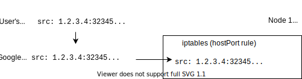

In this article, I will expand on the last diagram I drew for my post "[The
Packet's-Eye View of a Kubernetes Service](/packets-eye-of-a-service)".
Here is the diagram:


Notice one tiny mistake here: the port in `src: 1.2.3.4:80` is off! When
connecting to a remote host, the TCP stack picks a random ephemeral IP
above or equal 32768. The kernel calls it "local ports", see
[inet_hash_connect](https://github.com/torvalds/linux/blob/c60174717544aa8959683d7e19d568309c3a0c65/net/ipv4/inet_hashtables.c#L739-L740),
[secure_ipv4_port_ephemeral](https://github.com/torvalds/linux/blob/9c7db5004280767566e91a33445bf93aa479ef02/net/core/secure_seq.c)
and
[ip_local_port_range](https://github.com/torvalds/linux/blob/29d9f30d4ce6c7a38745a54a8cddface10013490/Documentation/networking/ip-sysctl.txt#L907-L914).
Let us fix this mistake and use the local port 32345 for example. In the
following diagram, we can see a packet coming from a user, then being
re-written by Google's VPC firewalls and finally coming into a VM "node 1":



So, how come the packet can come back and does it use conntrack?

> "conntrack" is a piece of the Linux kernel that is asked to remember
> connections that are forwarded. The initial packet hits the iptables
> machinery and conntrack remembers it so that further packets don't need
> to go through iptables again. You can list the tracked connections using
> the
> [conntrack(8)](https://manpages.debian.org/testing/conntrack/conntrack.8.en.html)
> tool. I mention it in "[Debugging Kubernetes
> Networking](/debugging-kubernetes-networking)".

Let us dive a bit more and add the "response" packets. For the following
diagram, I used the excellent [textik](https://textik.com/):

```plain
                     D-NAT (dest-based NAT, also called port-forwarding)

          +--------------------------------------------------------------------------+
          |   src: 90.76.45.149:32345                       src: 35.211.248.124:80   |
          |   dst: 35.211.248.124:80                        dst: 90.76.45.149:32345  |
          +------------------------------90.76.45.149--------------------------------+
                         |                 (user)                     |
                         |                                            |
          +--------------------------------------------------------------------------+
          |              |                one-to-one                  |              |
          |              v              port forwarding               |              |
          |   src: 90.76.45.149:32345          =          - src: 10.142.0.62:80      |
          | - dst: 35.211.248.124:80      no need for     + src: 35.211.248.124:80   |
          | + dst: 10.142.0.62:80         conntrack to      dst: 90.76.45.149:32345  |
          |              |                 remember!                  ^              |
          |              |                (stateless)                 |              |
          |              |                                            |              |
          +--------------|--------------35.211.248.124----------------|--------------+
                         |              (Google's VPC)                |
                         |                                            |
                         |                                            |
          +--------------|--------------------------------------------|--------------+
          |              v             userland process               |              |
          |   src: 90.76.45.149:32345      response         src: 10.142.0.62:80      |
          |   dst: 10.142.0.62:80      ---------------->    dst: 90.76.45.149:32345  |
          |                                                                          |
          +-------------------------------10.142.0.62--------------------------------+
                                          (VM in VPC)
```

<!-- https://textik.com/#0db10960397c06f5 -->

By reading through the diagram, we can see that the packet is re-written by
the Google's firewall using D-NAT: the destination is replaced by a fixed
IP, the one of the VM.

> Why do I say "packets" but what I should really say is "segments"? That's
> because I don't really know anyone using this strict terminology. Outside
> of the kernel and TCP/IP stack implementors, who actually cares about the
> L3 layer "units"? And I enjoy the "packet" word too more than "segment"!

Now, why do I care about Google's firewalls using conntracks? That's
because using conntrack requires more power since some state must be
stored. And state also means it is harder to scale since distributed state
is a hard problem!

As we can see on the diagram, the firewall does not need to remember
anything: it is just a static one-to-one relation between `10.142.0.62` and
`35.211.248.124`.

1. Outgoing traffic from your broadband modem router has to be SNATed
   (source-based NAT). The router needs to keep track of outgoing
   connections using conntrack.
2. Incoming traffic from the Internet to a Google Cloud VM has to go
   through the VPC firewall. The packet rewritting is very fast and very
   scalable since it only uses DNAT, which means no need to remember
   anything.
3. Must packet forwarding in Kubernetes also relies on stateless DNATing
   (e.g. hostPorts). Note that some parts of Kubernetes rely on stateful
   SNAT rewritting, for example when you use `policy: Cluster` which is the
   default policy for a Service. In the above diagram, you can see that
   happening:

   

<script src="https://utteranc.es/client.js"
        repo="maelvls/maelvls.github.io"
        issue-term="pathname"
        label="💬"
        theme="github-light"
        crossorigin="anonymous"
        async>
</script>
