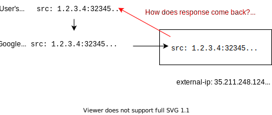
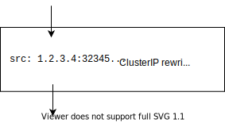

In a previous post "[The Packet's-Eye View of a Kubernetes
Service](/packets-eye-of-a-service)", I studied how traffic flows in when
using Kubernetes Services. In the last diagram of that post, I could not
clearly see how traffic could make its way back to the user. In this
article, I will try to understand how packets are able to flow back to the
user and why stateless rewritting is interesting.

In the following diagram, we can see a packet coming from a user, then
being re-written by Google's VPC firewalls and finally coming into a VM
"node 1".



So, how come the packet can come back ~~and does it use conntrack~~ and
does Google's firewall have to remember some state?

> **Update 14th April:** I initially thought that the conntrack kernel
> module would not register anything when using DNAT.
> [@networkop1](https://twitter.com/networkop1) showed me that conntrack
> registers the connection even for stateless DNATing.

> [conntrack](https://netfilter.org/documentation/HOWTO/netfilter-hacking-HOWTO-3.html#ss3.3)
> is a part of the netfilter suite in the Linux kernel. It is in charge of
> remembering connections that are forwarded. The initial packet hits the
> iptables machinery and conntrack remembers it so that further packets
> don't need to go through iptables again. You can list the tracked
> connections using the
> [conntrack(8)](https://manpages.debian.org/testing/conntrack/conntrack.8.en.html)
> tool. I mention it in "[Debugging Kubernetes
> Networking](/debugging-kubernetes-networking)".

Let us dive a bit more and add the "response" packets. For the following
diagram, I used the excellent [textik](https://textik.com/) ascii drawing
tool.

<div class="nohighlight">

```plain
                     D-NAT (dest-based NAT, also called port-forwarding)

          +--------------------------------------------------------------------------+
          |   src: 90.76.45.149:32345                       src: 35.211.248.124:80   |
          |   dst: 35.211.248.124:80                        dst: 90.76.45.149:32345  |
          +------------------------------90.76.45.149--------------------------------+
                         |                 (user)                     |
                         |                                            |
          +--------------------------------------------------------------------------+
          |              |                one-to-one                  |              |
          |              v              port forwarding               |              |
          |   src: 90.76.45.149:32345          =          - src: 10.142.0.62:80      |
          | - dst: 35.211.248.124:80      no need for     + src: 35.211.248.124:80   |
          | + dst: 10.142.0.62:80         conntrack to      dst: 90.76.45.149:32345  |
          |              |                 remember!                  ^              |
          |              |                (stateless)                 |              |
          |              |                                            |              |
          +--------------|--------------35.211.248.124----------------|--------------+
                         |              (Google's VPC)                |
                         |                                            |
                         |                                            |
          +--------------|--------------------------------------------|--------------+
          |              v             userland process               |              |
          |   src: 90.76.45.149:32345      response         src: 10.142.0.62:80      |
          |   dst: 10.142.0.62:80      ---------------->    dst: 90.76.45.149:32345  |
          |                                                                          |
          +-------------------------------10.142.0.62--------------------------------+
                                          (VM in VPC)
```

</div>

<!-- https://textik.com/#0db10960397c06f5 -->

By reading through the diagram, we can see that the packet is re-written by
the Google's firewall using DNAT: the destination is replaced by a fixed
IP, the one of the VM.

> Why do I say "packets" but what I should really say is "segments"? That's
> because I don't really know anyone using this strict terminology. Outside
> of the kernel and TCP/IP stack implementors, who actually cares about the
> L3 layer "units"? And I enjoy the "packet" word too more than "segment"!

Now, why do I care about Google's firewalls storing state? That's because
if some state about a connection has to be remembered, it means it is
harder to distribute the firewall horizontally, which makes it harder to
scale.

As we can see on the diagram, the firewall does not need to remember
anything: it is just a static one-to-one relation between `10.142.0.62` and
`35.211.248.124`.

---

Here is what I want to remember from this post:

1. Outgoing traffic from your broadband modem router has to be SNATed
   (source-based NAT). The router needs to keep track of outgoing
   connections using conntrack.
2. Incoming traffic from the Internet to a Google Cloud VM has to go
   through the VPC firewall. The packet rewritting is very fast and very
   scalable since it only uses DNAT, which means no need to remember
   anything.
3. Most packet forwarding in Kubernetes relies on stateless DNATing (e.g.
   `hostPort` or `nodePort`). Some parts of Kubernetes rely on stateful
   SNAT rewritting, for example when you use `externalTrafficPolicy:
   Cluster` in a which is the default policy for a Service. The following
   diagram shows where this rewriting happens (extracted from the diagram
   shown at the beginning of the post):

   

<script src="https://utteranc.es/client.js"
        repo="maelvls/maelvls.github.io"
        issue-term="pathname"
        label="💬"
        theme="github-light"
        crossorigin="anonymous"
        async>
</script>
