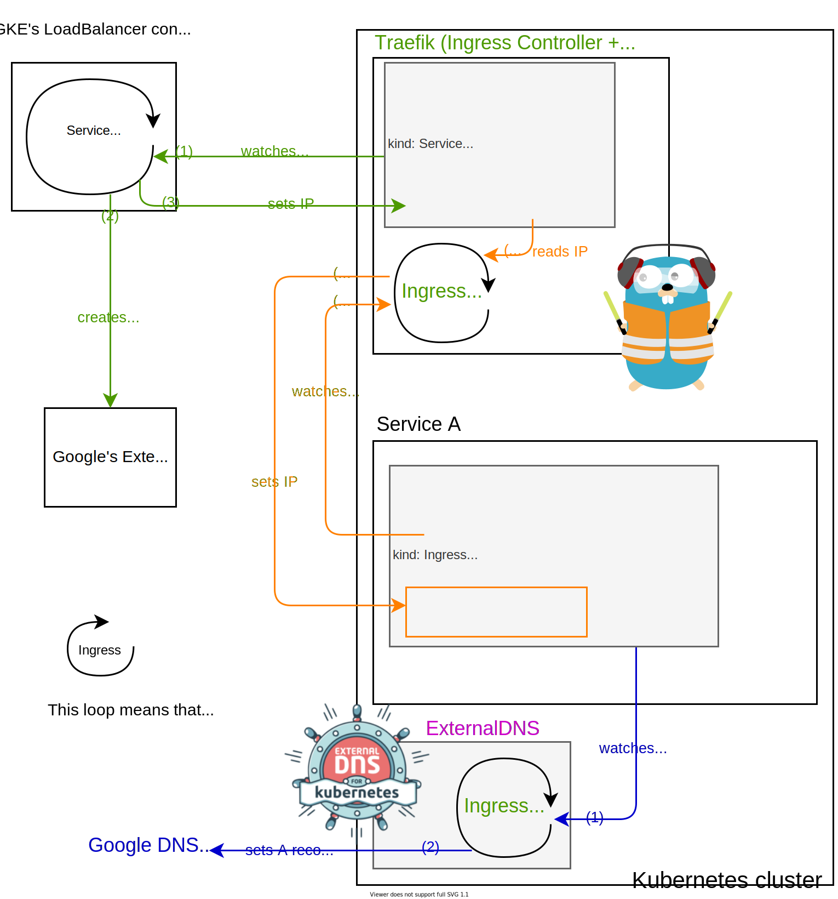
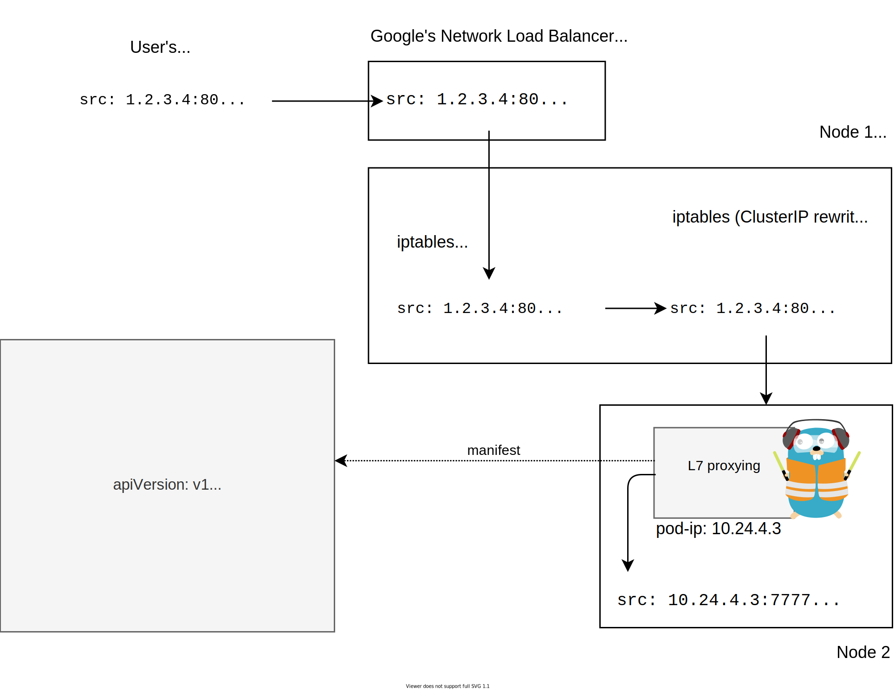
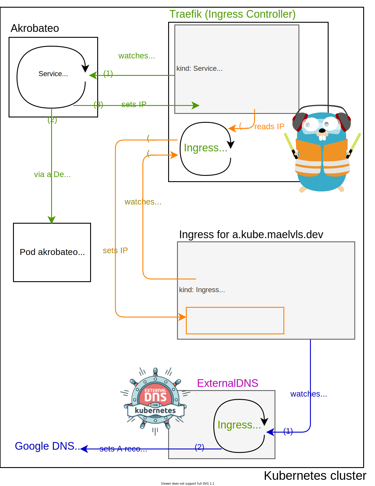

<!--

1. service vs. ingress (L4 vs L7)

<https://github.com/kubernetes/ingress-gce/search?p=3&q=LoadBalancer&unscoped_q=LoadBalancer>

2. how service and ingress interact with their controllers
3. traffic flow with GKE's service LB and Traefik
4. using my own service controller
5. traffic flow with my own service controller
6. comparison, benchmark, recap

-->

The Service and Ingress respectively brings L4 and L7 traffics to your
pods. I previously talked about [using `hostPort` to avoid GKE's load
balancer](/avoid-gke-lb-with-hostport/) without really getting into the
details of how everything works. In this article, I focus on how traffic
flows in and what are the interactions between the ingress controller and
the "service-lb controller" (the thing that creates the external load
balancer). I also detail how the `hostPort` approach shapes traffic.

---

In Kubernetes, the service object represents how a set of pods can be hit
with TCP or UDP connections. Since it is L4-only, the service only deals
with IPs and ports. An Ingress is the L7 counterpart of a service: it deals
with TLS, hostnames, HTTP paths and virtual servers (called "backends").

> Note: you might see some mentions of ingresses since Traefik is an
> ingress controller but I will not describe the traffic handling at the L7
> level.

An ingress controller is a binary running as a simple deployment that
watches all Ingress objects and live-updates the L7 proxy. Traefik
qualifies as an ingress controllers: it has the nice property of embeding
both the "ingress watcher" and the L7 proxy in a single binary. HAProxy and
Nginx both use separate ingress controllers. And in order to get L4 traffic
coming to the L7 proxy, we usually use a service that has the type
`LoadBalancer`.

I call "service-lb controller" a binary that watches service objects that
have the `LoadBalancer` type. Any time the Google's service-lb controller
sees a new `LoadBalancer` service, it spins up a Network Load Balancer and
sets up some firewall rules. In fact, Google's service-lb controller runs
as a small closed-source binary that runs on your master node (but not
visible as a pod) and acts as a service-lb controller.

Here is a diagram that represents how GKE's service-lb controller interacts
with the ingress controller:



So, how does external traffic make it to the pod? The following diagram
shows how a packet is forwarded to the right pod. Notice how many iptable
rewriting happen (which corresponds to one connection managed by
conntrack):



Now, let's see how it goes when using
[Akrobateo](https://github.com/kontena/akrobateo) (I detailed that
[here](/avoid-gke-lb-with-hostport/)). Instead of using an external
compute resource, we use the node's IP in order to let traffic in.

Note: Akrobateo is EOL, but K3s's
[servicelb](https://github.com/rancher/k3s/blob/master/pkg/servicelb/controller.go)
and [Metallb](https://github.com/metallb/metallb) work in a very similar
way, setting the service's `status.loadBalancer` field with the correct
external IP.



You might wonder why the 'internal IP' is used in `status.loadBalancer`. We
might expect the external IP to be set there. But since Google's VPC NAT
swaps the node's external IP to the node's internal IP, the incoming
packets have the internal IP as source IP. So that's why 😁.

The following diagram shows a packet coming from a user being routed to the
Service that has the ClusterIP `10.24.3.12`. Notice the number of packet
rewritings:

1. DNAT by the VPC firewall,
2. DNAT in the `hostPort` rule on node 1,
3. DNAT in the Akrobateo pod,
4. DNAT for the Service ClusterIP rule on node 1,
5. SNAT due to the `externalTrafficPolicy: Cluster` rule on node 1
  (service-level random load-balancing across nodes),
1. User-space TCP termination by Traefik (i.e., new dial to the pod-ip).

That's a lot of hops and rewritings!


> **Update 28 April 2020**: Fixed a mistake I made in this diagram. I had
> set the source port to 80 in the "User's request". This example does not
> reflect what happens in reality. When connecting to a remote host, the
> TCP stack picks a random ephemeral IP above or equal 32768. The kernel
> calls it "local ports", see [`inet_hash_connect`
> (`inet_hashtables.c`)](https://github.com/torvalds/linux/blob/c60174717544aa8959683d7e19d568309c3a0c65/net/ipv4/inet_hashtables.c#L739-L740),
> [`secure_ipv4_port_ephemeral`
> (`secure_seq.c`)](https://github.com/torvalds/linux/blob/9c7db5004280767566e91a33445bf93aa479ef02/net/core/secure_seq.c)
> and [`ip_local_port_range`
> (`ip-sysctl.txt`)](https://github.com/torvalds/linux/blob/29d9f30d4ce6c7a38745a54a8cddface10013490/Documentation/networking/ip-sysctl.txt#L907-L914).
>
> So I changed the "User's request" source port from 80 to 32345:
>
> ```diff
> -src: 1.2.3.4:80
> +src: 1.2.3.4:32345
>  dst: 35.211.248.124:80
> ```

With the "Akrobateo" method, we only rely on the VPC's firewall rules. But
using the node's IP is not perfect: it might be a seen as a security risk,
and the many IPs that end up in the service's `status.loadBalancer` isn't
ideal when it comes to setting your DNS `A` records:

- when a node disappears, the DNS might forward traffic to a unexisting node,
- offloading ingress traffic load balancing from a load balancer with a
  single IP to relying on DNS records isn't ideal since DNS records leave
  you very few options as to how to balance traffic.

K3s uses this approach of using the node IPs as service backends and does
not need any external load balancer.

**Update 28 April 2020**: fixed an error with the source port in the last
diagram. Added the list of DNAT and SNAT rewritings that happen in the last
diagram. I also rewrote the introduction.


