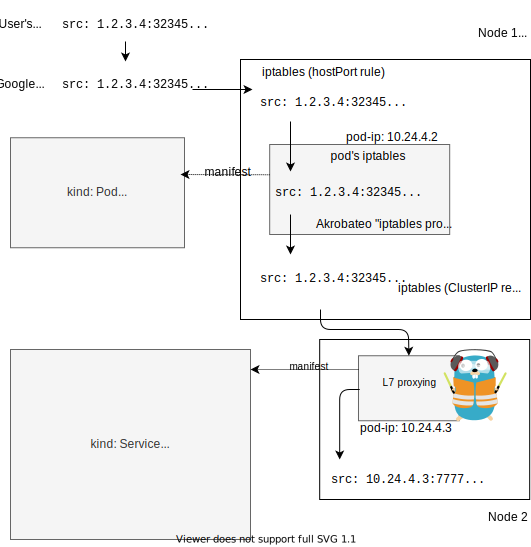

1. service vs. ingress (L4 vs L7)

<https://github.com/kubernetes/ingress-gce/search?p=3&q=LoadBalancer&unscoped_q=LoadBalancer>

2. how service and ingress interact with their controllers
3. traffic flow with GKE's service LB and Traefik
4. using my own service controller
5. traffic flow with my own service controller
6. comparison, benchmark, recap

