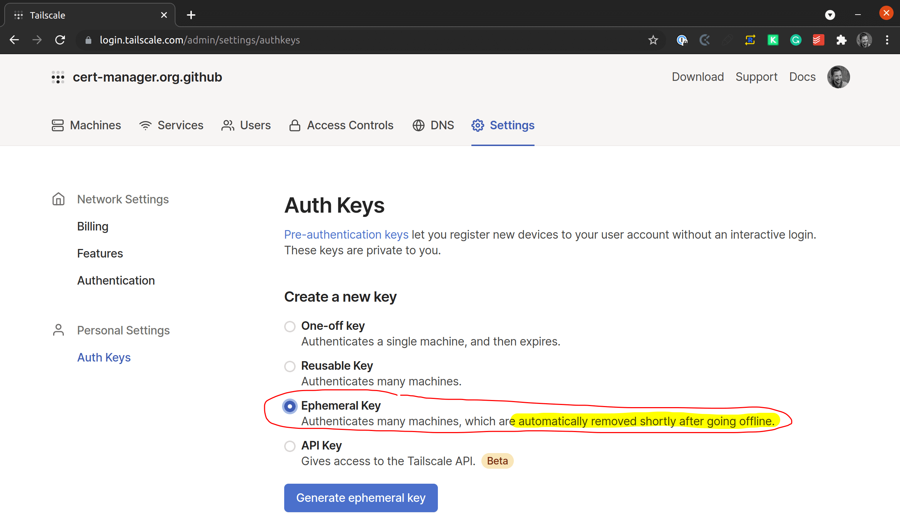
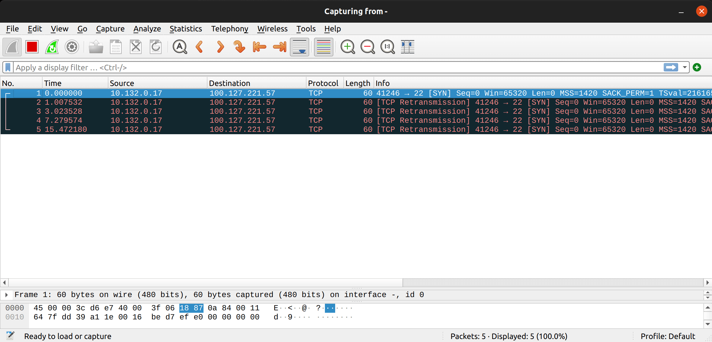
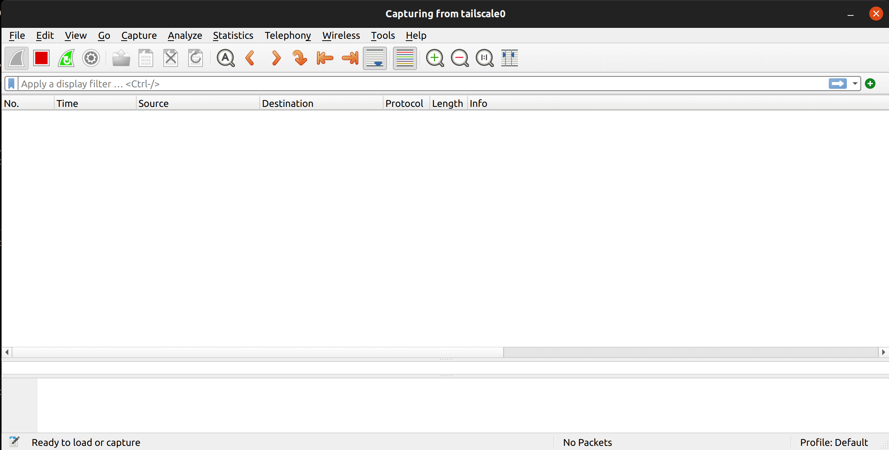
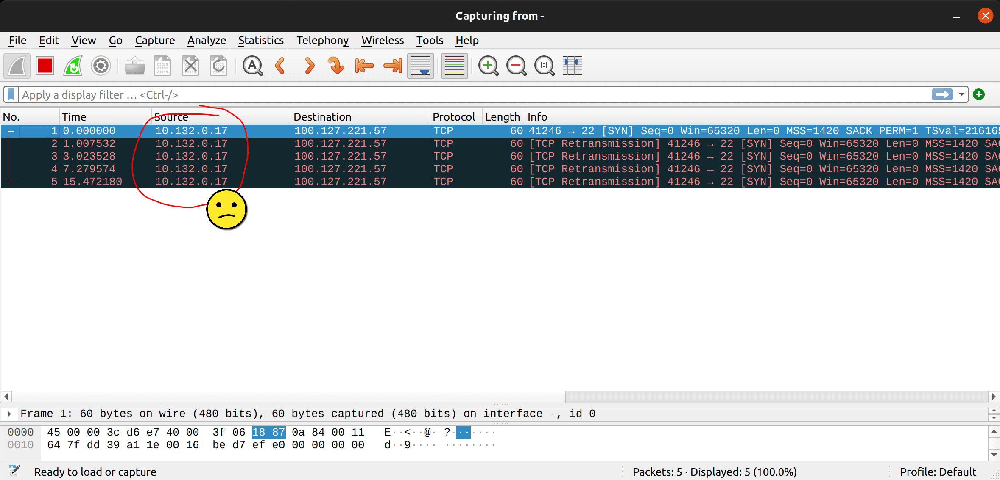

# Access Private IPs From Kubernetes With Tailscale

I want to give all my Kubernetes pods access to my PC that is on a private network. The plan is to use a GCP VM as a "relay" where Tailscale is running and configure the VPC to forward traffic to the relay.

| Machine       | GCP IPs     | Tailscale IPs  |
| ------------- | ----------- | -------------- |
| aorus (my PC) |             | 100.127.221.57 |
| relay         | 10.132.0.16 | 100.82.245.178 |
| test          | 10.132.0.17 |                |

The first step is to get an ephemeral token on Tailscale:



Now, let us create the relay VM:

```sh
TOKEN=...
gcloud compute instances create relay --machine-type f1-micro --zone europe-west1-c \
    --project jetstack-mael-valais --can-ip-forward \
    --metadata=startup-script="sudo tee -a /etc/sysctl.conf <<<$'net.ipv4.ip_forward=1\nnet.ipv6.conf.all.forwarding=1' && tee .profile -a <<<'PATH=\$PATH:/sbin:/usr/sbin' && sudo update-alternatives --set iptables /usr/sbin/iptables-legacy && curl -fsSL https://pkgs.tailscale.com/stable/ubuntu/focal.gpg | sudo apt-key add - && curl -fsSL https://pkgs.tailscale.com/stable/ubuntu/focal.list | sudo tee /etc/apt/sources.list.d/tailscale.list && sudo apt-get update && sudo apt-get install tailscale && sudo tailscale up --authkey $TOKEN"
```

> Note: the `update-alternatives` trick above is due to the fact that we are using Debian 10 that defaults `iptables` to its NF version. Here, we want to be using the legacy way.

Now, let us make sure that all traffic that has the Tailscale IP as destination on my GCP project get routed to the relay VM:

```sh
gcloud compute routes create tailscale --destination-range=100.64.0.0/10 \
    --next-hop-instance=relay --project jetstack-mael-valais
```

```sh
$ gcloud compute ssh relay -- tailscale status
100.82.245.178  hit-me               maelvls@     linux   -
100.127.221.57  aorus                maelvls@     linux   idle, tx 4396 rx 3076
```

At this point, I thought I was done, but I wasn't. I created a test VM on my
project to test the setup:

```sh
gcloud compute instances create test --machine-type f1-micro --zone europe-west1-c --project jetstack-mael-valais
gcloud compute ssh test -- sudo apt install netcat -y
```

It seems like my PC is not reachable from the test VM:

```sh
$ gcloud compute ssh test -- nc -v 100.127.221.57 22
(UNKNOWN) [100.127.221.57] 22 (ssh) : Connection timed out
```

```sh
gcloud compute ssh relay --command "sudo tcpdump -U -i tailscale0 -w -" | wireshark -k -y RAW -i -
```



The packets seem to be sent correctly to my PC, but nothing is received. Let us see on my PC if anything gets received:



No surprise, no packet is received. If we look closer to the packet that the relay is trying to send to my PC, we can see that the source address isn't routable from my PC:



My guess is that the relay VM was able to send its packet, but my PC wouldn't know how to send it back. I figured it needed changing the source IP:

```sh
# Won't be saved after a reboot of the VM!
gcloud compute ssh relay -- sudo iptables -t nat -A POSTROUTING -j SNAT --to-source 100.82.245.178
```

Retrying the test, it works:

```sh
$ gcloud compute ssh test -- nc -v 100.127.221.57 22
100.127.221.57: inverse host lookup failed: Unknown host
(UNKNOWN) [100.127.221.57] 22 (ssh) open
SSH-2.0-OpenSSH_8.4p1 Ubuntu-5ubuntu1.1
```

> **Note:** In order to reset the in-memory iptables rules, you can run:
>
> ```sh
> sudo iptables -P INPUT ACCEPT
> sudo iptables -P OUTPUT ACCEPT
> sudo iptables -P FORWARD ACCEPT
> sudo iptables -F
> sudo iptables -X
> sudo iptables -t nat -F
> sudo iptables -t nat -X
> sudo iptables -t mangle -F
> sudo iptables -t mangle -X
> ```

Let us see if we can reach my PC from a GKE cluster:

```sh
$ gcloud container clusters create foo --project=jetstack-mael-valais --zone=europe-west2-b
$ gcloud container clusters get-credentials foo --project=jetstack-mael-valais --zone=europe-west2-b
$ kubectl run c -it --rm --restart=Never -q --image=nicolaka/netshoot
% nc -v 100.127.221.57 22
Connection to 100.127.221.57 22 port [tcp/ssh] succeeded!
SSH-2.0-OpenSSH_8.4p1 Ubuntu-5ubuntu1.1
```

Excellent!

## Conclusion

Although pods can access Tailscale IPs, it does not work with the MagicDNS feature. The only way (I mean, the only "easy" way) would be to have a container sidecar with `CAP_NET_ADMIN` with Tailscale running along with the pod that requires access to the Tailscale IPs.
