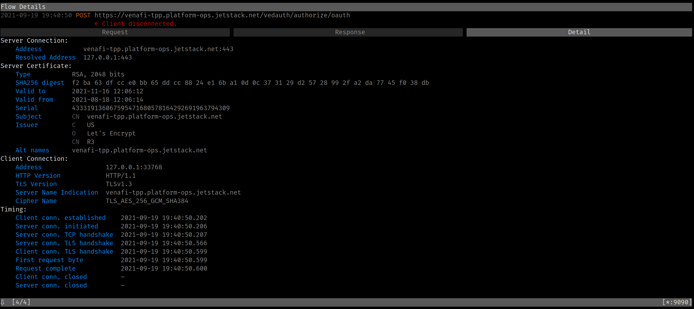

I frequently use mitmproxy to inspect what HTTP requests and responses look like under the hood. Inspecting HTTP flows comes in handy with tools that tend to hide the actual JSON error messages.

One tool I have been using a lot is [`vcert`](https://github.com/Venafi/vcert). `vcert` allows you to request X.509 certificates from Venafi Trust Protection Platform (TTP) as well as Venafi Cloud.

In the following example, I give an unknown client ID `duh`. `vcert` just tells me about the error in the initial HTTP header:

```sh
$ vcert getcred --username foo --password bar --client-id=duh --verbose
vCert: 2021/09/19 19:23:56 Getting credentials...
vCert: 2021/09/19 19:23:56 Got 400 Bad Request status for POST https://venafi-tpp.platform-ops.jetstack.net/vedauth/authorize/oauth
vCert: 2021/09/19 19:24:05 unexpected status code on TPP Authorize. Status: 400 Bad Request
```

I am sure that the HTTP API is returning more than just the HTTP header `400 Bad Request`!

But when I try using mitmproxy, I get the following error:

```
$ HTTPS_PROXY=:9090 vcert getcred --username foo --password bar --client-id=duh --verbose
vCert: 2021/09/19 19:29:20 Getting credentials...
vCert: 2021/09/19 19:29:50 Post "https://venafi-tpp.platform-ops.jetstack.net/vedauth/authorize/oauth": context deadline exceeded (Client.Timeout exceeded while awaiting headers)
```


Looking at the "Detail" tab for the HTTP call recorded in mitmproxy, I can see that the HTTP request was acknowledged by the TPP server (see the "Request complete" time). For some reason, the response never arrives.



Let us dig a bit deeper and see what is the difference between "with" and "without" mitmproxy using [WireShark](https://www.wireshark.org/). Without mitmproxy, `vcert` succeeds:


But with mitmproxy, `vcert` hangs:


The difference between both flows seems to be the "Encrypted Handshake Message" that occurs right after the HTTP requests has been sent.

> Note that you can see the above two PCAP traces by downloading [vcert-with-and-without-mitmproxy-through-iap.pcapng](vcert-with-and-without-mitmproxy-through-iap.pcapng).

Now, let us decrypt this TLS flow. WireShark being a passive capture tool (unlike mitmproxy), it won't be able to decrypt traffic. Fortunately, mitmproxy is able to dump the master secret (see the page [Wireshark and SSL/TLS Master Secrets](https://docs.mitmproxy.org/stable/howto-wireshark-tls/). After giving the master secret to WireShark, we can see the decrypted traffic:


The above screenshot validates the fact that the "Application Data" that we could see in the previous two screenshots was in fact the HTTP request.

We also notice that the mysterious "Encrypted Handshake Message" is a Hello Request, signifying a TLS renegotiation as described in [RFC 5246](https://datatracker.ietf.org/doc/html/rfc5246#section-7.4.1.1).

> As a side note, here is what the master secret look like when mitmproxy records it (that's the file I passed to WireShark):
>
> ```sh
> # Content of sslkeylogfile
> CLIENT_RANDOM 5bdb7b7d88a325a08ee922a89b7b8acbbcda36f7d800c4e2f763b4689cfd870b 083f22af3099558997f784c47c4145dd9155c20f97fa5701bffe7003d80c7ad31801cfabb9be5838bf8f4f58e6b971f7
> SERVER_HANDSHAKE_TRAFFIC_SECRET caa526a0b8e35551a2feee9de685e74547a7b0abc3ae5422a4bebe42d74132b4 7ac126e6a9b651ee9585a902248ac5bc5cdfa3a8989852f491b52ec013a9be170dce24076c305c5b9e7209c325a9f530
> CLIENT_HANDSHAKE_TRAFFIC_SECRET caa526a0b8e35551a2feee9de685e74547a7b0abc3ae5422a4bebe42d74132b4 37fa20e94a385b79901a0615ef7c2de091e98757e85958deb9a242a3b0bed74e3be290d816555a3da816dd60d4f0c9f3
> EXPORTER_SECRET caa526a0b8e35551a2feee9de685e74547a7b0abc3ae5422a4bebe42d74132b4 d436ff8840245be887e15d11000a98d971df4f1f0d825b7eb470a37fe2e9f7d1759967fe52e055cb9b5e74373e36f276
> SERVER_TRAFFIC_SECRET_0 caa526a0b8e35551a2feee9de685e74547a7b0abc3ae5422a4bebe42d74132b4 615847eb91285a78981cf5072a9597e2ef4549c92d695818b9e05c270950b5ec88fcb62969b353b38ea2cd18597ee01d
> CLIENT_TRAFFIC_SECRET_0 caa526a0b8e35551a2feee9de685e74547a7b0abc3ae5422a4bebe42d74132b4 4705201529b85b5cbdcbd74dfdf5cf2019ff9e520de551d2aaaa14962668ed3aa0a79416d1795d5eb53be93ddeb077de
> ```
>
> The master secret is comprised of 96 hexadecimal characters, which corresponds to 48 bytes.

It seems like mitmproxy does not support server-side initiated TLS renegotiation. Looking at its source code, it seems like everything after the end of the first handshake is considered to be data, and subsequent Handshake Messages make mitmproxy "hang".

Now, why would TLS renegotiation be necessary after the HTTP request is sent? The issue named [Venafi Issuer error when configuring cert-manager. "local error: tls: no renegotiation"](https://github.com/Venafi/vcert/issues/148) gives us a clue: Microsoft IIS, which is the web server used by Venafi TPP, is capable of authenticating an incoming connection using a client certificate depending on the HTTP request's URL path. Looking at the IIS configuration, we can see that the `/vedauth` endpoint has its "client certificate" settings configured to "Accept":


Let us see this behavior in action by creating a TLS tunnel using openssl. With the path `/vedsdk`, we can see that openssl does not seem to renegotiate the TLS connection:

<script id="asciicast-cAS7XfBwpKby1F7vHZOXRAqZK" src="https://asciinema.org/a/cAS7XfBwpKby1F7vHZOXRAqZK.js" async></script>

The HTTP request I made was:

```http
HTTP /vedsdk/ HTTP/1.1
Host: venafi-tpp.platform-ops.jetstack.net
Content-Length: 0
```

With the endpoint `/vedauth`, which is the one for which mitmproxy is hanging on, openssl does two TLS negotiations:

<script id="asciicast-nrlOK86ycQ8Legbz7wtYaoUWA" src="https://asciinema.org/a/nrlOK86ycQ8Legbz7wtYaoUWA.js" async></script>

The request was:

```http
HTTP /vedauth/ HTTP/1.1
Host: venafi-tpp.platform-ops.jetstack.net
Content-Length: 0
```

In the first example (`/vedsdk`), the HTTP response is sent immediately without any TLS negotiation. In the second example (`/vedauth`), a TLS renegotiation is performed right after the HTTP request is sent, and the HTTP response is sent over this new TLS session.

The only explanation for this behavior is that this allows IIS to refuse clients that present an invalid client certificates only for paths for which client certificates are enabled, instead of refusing to serve all paths. I would need to learn a bit more about TLS and how IIS is able to give the information about the identity of a client certificate to the HTTP layer to know whether it should look for an `Authorization: Bearer foo` HTTP header.

The only workaround I have come up with is to turn the client certificate option to "Ignore":


This time, vcert over mitmproxy works!


One thing I would like to do in the future is to add support for TLS renegotiation to mitmproxy!
