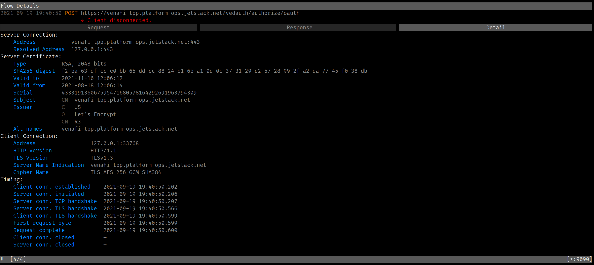

I frequently use mitmproxy to inspect what HTTP requests and responses look like under the hood. Inspecting HTTP flows comes in handy with tools that tend to hide the actual JSON error messages.

One tool I have been using a lot is [`vcert`](https://github.com/Venafi/vcert). `vcert` allows you to request X.509 certificates from Venafi Trust Protection Platform (TTP) as well as Venafi Cloud.

In the following example, I give an unknown client ID `duh`. `vcert` just tells me about the error in the initial HTTP header:

```sh
$ vcert getcred --username foo --password bar --client-id=duh --verbose
vCert: 2021/09/19 19:23:56 Getting credentials...
vCert: 2021/09/19 19:23:56 Got 400 Bad Request status for POST https://venafi-tpp.platform-ops.jetstack.net/vedauth/authorize/oauth
vCert: 2021/09/19 19:24:05 unexpected status code on TPP Authorize. Status: 400 Bad Request
```

I am sure that the HTTP API is returning more than just the HTTP header `400 Bad Request`!

But when I try using mitmproxy, I get the following error:

```
$ HTTPS_PROXY=:9090 vcert getcred --username foo --password bar --client-id=duh --verbose
vCert: 2021/09/19 19:29:20 Getting credentials...
vCert: 2021/09/19 19:29:50 Post "https://venafi-tpp.platform-ops.jetstack.net/vedauth/authorize/oauth": context deadline exceeded (Client.Timeout exceeded while awaiting headers)
```

Looking at the "Detail" tab for the HTTP call recorded in mitmproxy, I can see that the HTTP request was acknowledged by the TPP server (see the "Request complete" time):



For some reason, the response never arrives. At this point, I had the following hypothesis:

-

When using mitmproxy, I hit an issue with vcert: the vcert HTTP requests would
not be responded to with mitmproxy in-between.

- 10.132.0.13 = the TPP instance IP,
- 35.235.243.226 = the iap proxy IP.

Using a direct connection (vcert -> iap proxy -> tpp instance), the HTTP request
succeeds:

```
             35.235.243.226    ->    10.132.0.13      TCP         74      46011 → 443 [SYN]
             10.132.0.13       ->    35.235.243.226   TCP         74      443 → 46011 [SYN, ACK]
             35.235.243.226    ->    10.132.0.13      TCP         66      46011 → 443 [ACK]
             35.235.243.226    ->    10.132.0.13      TLSv1.2     354     Client Hello
             10.132.0.13       ->    35.235.243.226   TLSv1.2     3474    Server Hello, Certificate, Certificate Status, Server Key Exchange, Server Hello Done
             35.235.243.226    ->    10.132.0.13      TCP         66      46011 → 443 [ACK]
             35.235.243.226    ->    10.132.0.13      TLSv1.2     159     Client Key Exchange, Change Cipher Spec, Encrypted Handshake Message
             10.132.0.13       ->    35.235.243.226   TLSv1.2     117     Change Cipher Spec, Encrypted Handshake Message
             35.235.243.226    ->    10.132.0.13      TCP         66      46011 → 443 [ACK]
    request  35.235.243.226    ->    10.132.0.13      TLSv1.2     470     Application Data
             10.132.0.13       ->    35.235.243.226   TLSv1.2     99      Encrypted Handshake Message
             35.235.243.226    ->    10.132.0.13      TCP         66      46011 → 443 [ACK]
   1st diff  35.235.243.226    ->    10.132.0.13      TLSv1.2     390     Encrypted Handshake Message
             10.132.0.13       ->    35.235.243.226   TLSv1.2     3552    Encrypted Handshake Message
             35.235.243.226    ->    10.132.0.13      TCP         66      46011 → 443 [ACK]
tls renego?  35.235.243.226    ->    10.132.0.13      TLSv1.2     243     Encrypted Handshake Message, Encrypted Handshake Message, Change Cipher Spec, Encrypted Handshake Message
             10.132.0.13       ->    35.235.243.226   TLSv1.2     141     Change Cipher Spec, Encrypted Handshake Message
             35.235.243.226    ->    10.132.0.13      TCP         66      46011 → 443 [ACK]
   response  10.132.0.13       ->    35.235.243.226   TLSv1.2     704     Application Data
             35.235.243.226    ->    10.132.0.13      TCP         66      46011 → 443 [FIN, ACK]
             10.132.0.13       ->    35.235.243.226   TCP         66      443 → 46011 [ACK]
```

Using mitmproxy in between (vcert -> mitmproxy -> iap proxy -> tpp instance),
the HTTP request is correctly sent and aknowledged, but hangs after that:

```
             35.235.243.226    ->    10.132.0.13      TCP         74      37677 → 443 [SYN] Seq=0 Win=65535 Len=0 MSS=1420 SACK_PERM=1 TSval=2496784362 TSecr=0 WS=256
             10.132.0.13       ->    35.235.243.226   TCP         74      443 → 37677 [SYN, ACK] Seq=0 Ack=1 Win=8192 Len=0 MSS=1420 WS=256 SACK_PERM=1 TSval=3076275429 TSecr=2496784362
             35.235.243.226    ->    10.132.0.13      TCP         66      37677 → 443 [ACK] Seq=1 Ack=1 Win=65536 Len=0 TSval=2496784362 TSecr=3076275429
             35.235.243.226    ->    10.132.0.13      TLSv1.2     396     Client Hello
             10.132.0.13       ->    35.235.243.226   TLSv1.2     2963    Server Hello, Certificate, Server Key Exchange, Server Hello Done
             35.235.243.226    ->    10.132.0.13      TCP         66      37677 → 443 [ACK] Seq=331 Ack=2898 Win=71424 Len=0 TSval=2496784400 TSecr=3076275468
             35.235.243.226    ->    10.132.0.13      TLSv1.2     159     Client Key Exchange, Change Cipher Spec, Encrypted Handshake Message
             10.132.0.13       ->    35.235.243.226   TLSv1.2     117     Change Cipher Spec, Encrypted Handshake Message
             35.235.243.226    ->    10.132.0.13      TCP         66      37677 → 443 [ACK] Seq=424 Ack=2949 Win=71424 Len=0 TSval=2496784432 TSecr=3076275494
    request  35.235.243.226    ->    10.132.0.13      TLSv1.2     333     Application Data
    request  35.235.243.226    ->    10.132.0.13      TLSv1.2     230     Application Data
             10.132.0.13       ->    35.235.243.226   TCP         66      443 → 37677 [ACK] Seq=2949 Ack=855 Win=2105856 Len=0 TSval=3076275545 TSecr=2496784477
             10.132.0.13       ->    35.235.243.226   TLSv1.2     99      Encrypted Handshake Message
             35.235.243.226    ->    10.132.0.13      TCP         66      37677 → 443 [ACK] Seq=855 Ack=2982 Win=71424 Len=0 TSval=2496784478 TSecr=3076275545
```

You can see the full PCAP traces by downloading
[vcert-with-and-without-mitmproxy-through-iap.pcapng](vcert-with-and-without-mitmproxy-through-iap.pcapng).

The difference between both TLS flows seemed to be the second `Change Cipher Spec` that happens in the first flow (without mitmproxy). I knew from previous
experiment that our TPP instance was using TLS renegociation whenever the
VEDAuth IIS endpoint's SSL "Client Certificate" was set to "Accept". This
behavior is detailed in the vcert issue [Venafi Issuer error when configuring
cert-manager. "local error: tls: no
renegotiation"](https://github.com/Venafi/vcert/issues/148).

And sure enough, disabling the client certificate option worked! After switching
the option from "Accept" to "Disable", vcert with mitmproxy started working!


