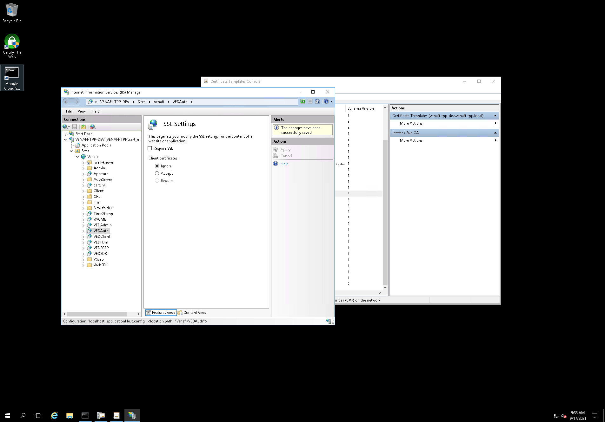

When using mitmproxy, I hit an issue with vcert: the vcert HTTP requests would
not be responded to with mitmproxy in-between.

- 10.132.0.13 = the TPP instance IP,
- 35.235.243.226 = the iap proxy IP.

Using a direct connection (vcert -> iap proxy -> tpp instance), the HTTP request
succeeds:

```
             35.235.243.226    ->    10.132.0.13      TCP         74      46011 → 443 [SYN] Seq=0 Win=65535 Len=0 MSS=1420 SACK_PERM=1 TSval=2496652920 TSecr=0 WS=256
             10.132.0.13       ->    35.235.243.226   TCP         74      443 → 46011 [SYN, ACK] Seq=0 Ack=1 Win=8192 Len=0 MSS=1420 WS=256 SACK_PERM=1 TSval=3076143986 TSecr=2496652920
             35.235.243.226    ->    10.132.0.13      TCP         66      46011 → 443 [ACK] Seq=1 Ack=1 Win=65536 Len=0 TSval=2496652920 TSecr=3076143986
             35.235.243.226    ->    10.132.0.13      TLSv1.2     354     Client Hello
             10.132.0.13       ->    35.235.243.226   TLSv1.2     3474    Server Hello, Certificate, Certificate Status, Server Key Exchange, Server Hello Done
             35.235.243.226    ->    10.132.0.13      TCP         66      46011 → 443 [ACK] Seq=289 Ack=3409 Win=72448 Len=0 TSval=2496652960 TSecr=3076144026
             35.235.243.226    ->    10.132.0.13      TLSv1.2     159     Client Key Exchange, Change Cipher Spec, Encrypted Handshake Message
             10.132.0.13       ->    35.235.243.226   TLSv1.2     117     Change Cipher Spec, Encrypted Handshake Message
             35.235.243.226    ->    10.132.0.13      TCP         66      46011 → 443 [ACK] Seq=382 Ack=3460 Win=72448 Len=0 TSval=2496653021 TSecr=3076144087
    request  35.235.243.226    ->    10.132.0.13      TLSv1.2     470     Application Data
             10.132.0.13       ->    35.235.243.226   TLSv1.2     99      Encrypted Handshake Message
             35.235.243.226    ->    10.132.0.13      TCP         66      46011 → 443 [ACK] Seq=786 Ack=3493 Win=72448 Len=0 TSval=2496653053 TSecr=3076144114
   1st diff  35.235.243.226    ->    10.132.0.13      TLSv1.2     390     Encrypted Handshake Message
             10.132.0.13       ->    35.235.243.226   TLSv1.2     3552    Encrypted Handshake Message
             35.235.243.226    ->    10.132.0.13      TCP         66      46011 → 443 [ACK] Seq=1110 Ack=6979 Win=79360 Len=0 TSval=2496653076 TSecr=3076144142
tls renego?  35.235.243.226    ->    10.132.0.13      TLSv1.2     243     Encrypted Handshake Message, Encrypted Handshake Message, Change Cipher Spec, Encrypted Handshake Message
             10.132.0.13       ->    35.235.243.226   TLSv1.2     141     Change Cipher Spec, Encrypted Handshake Message
             35.235.243.226    ->    10.132.0.13      TCP         66      46011 → 443 [ACK] Seq=1287 Ack=7054 Win=79360 Len=0 TSval=2496653109 TSecr=3076144170
   response  10.132.0.13       ->    35.235.243.226   TLSv1.2     704     Application Data
             35.235.243.226    ->    10.132.0.13      TCP         66      46011 → 443 [FIN, ACK] Seq=1287 Ack=7693 Win=82176 Len=0 TSval=2496653497 TSecr=3076144562
             10.132.0.13       ->    35.235.243.226   TCP         66      443 → 46011 [ACK] Seq=7693 Ack=1288 Win=2105344 Len=0 TSval=3076144563 TSecr=2496653497
```

Using mitmproxy in between (vcert -> mitmproxy -> iap proxy -> tpp instance),
the HTTP request is correctly sent and aknowledged, but hangs after that:

```
             35.235.243.226    ->    10.132.0.13      TCP         74      37677 → 443 [SYN] Seq=0 Win=65535 Len=0 MSS=1420 SACK_PERM=1 TSval=2496784362 TSecr=0 WS=256
             10.132.0.13       ->    35.235.243.226   TCP         74      443 → 37677 [SYN, ACK] Seq=0 Ack=1 Win=8192 Len=0 MSS=1420 WS=256 SACK_PERM=1 TSval=3076275429 TSecr=2496784362
             35.235.243.226    ->    10.132.0.13      TCP         66      37677 → 443 [ACK] Seq=1 Ack=1 Win=65536 Len=0 TSval=2496784362 TSecr=3076275429
             35.235.243.226    ->    10.132.0.13      TLSv1.2     396     Client Hello
             10.132.0.13       ->    35.235.243.226   TLSv1.2     2963    Server Hello, Certificate, Server Key Exchange, Server Hello Done
             35.235.243.226    ->    10.132.0.13      TCP         66      37677 → 443 [ACK] Seq=331 Ack=2898 Win=71424 Len=0 TSval=2496784400 TSecr=3076275468
             35.235.243.226    ->    10.132.0.13      TLSv1.2     159     Client Key Exchange, Change Cipher Spec, Encrypted Handshake Message
             10.132.0.13       ->    35.235.243.226   TLSv1.2     117     Change Cipher Spec, Encrypted Handshake Message
             35.235.243.226    ->    10.132.0.13      TCP         66      37677 → 443 [ACK] Seq=424 Ack=2949 Win=71424 Len=0 TSval=2496784432 TSecr=3076275494
    request  35.235.243.226    ->    10.132.0.13      TLSv1.2     333     Application Data
    request  35.235.243.226    ->    10.132.0.13      TLSv1.2     230     Application Data
             10.132.0.13       ->    35.235.243.226   TCP         66      443 → 37677 [ACK] Seq=2949 Ack=855 Win=2105856 Len=0 TSval=3076275545 TSecr=2496784477
             10.132.0.13       ->    35.235.243.226   TLSv1.2     99      Encrypted Handshake Message
             35.235.243.226    ->    10.132.0.13      TCP         66      37677 → 443 [ACK] Seq=855 Ack=2982 Win=71424 Len=0 TSval=2496784478 TSecr=3076275545
```

You can see the full PCAP traces by downloading
[vcert-with-and-without-mitmproxy-through-iap.pcapng](vcert-with-and-without-mitmproxy-through-iap.pcapng).

The difference between both TLS flows seemed to be the second `Change Cipher Spec` that happens in the first flow (without mitmproxy). I knew from previous
experiment that our TPP instance was using TLS renegociation whenever the
VEDAuth IIS endpoint's SSL "Client Certificate" was set to "Accept". This
behavior is detailed in the vcert issue [Venafi Issuer error when configuring
cert-manager. "local error: tls: no
renegotiation"](https://github.com/Venafi/vcert/issues/148).

And sure enough, disabling the client certificate option worked! After switching
the option from "Accept" to "Disable", vcert with mitmproxy started working!


