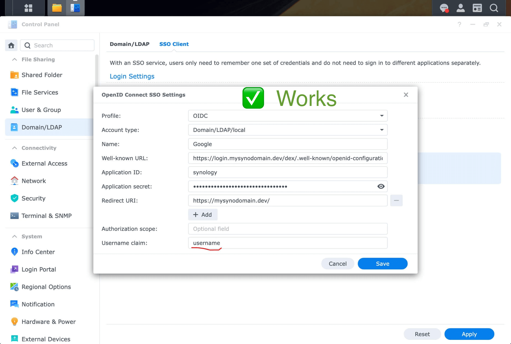

## Introduction

My parents and I share a DS923+. We mainly use it for storing photos. To save energy, the NAS is stopped at night and restarted in the morning. Restarting the NAS means that you need to log in to the UI at least once every day.

And since my parents don't use the Synology often, they would first struggle remembering what the username thing is about. And then, they would forget about their password, which would lead to me having to reset it because Synology hasn't implemented a way to reset the password over email:


Over the past two years, my parents forgot their passwords a couple of times. It led me to look for an alternative way to log into the NAS... why not use their Google accounts using the single sign-on mechanism?

## Challenges with Local Accounts and SSO

A couple of years ago, Synology introduced SSO (single sign-on). Since 7.2, DSM supports generic OIDC providers, and supports logging into local users (it used to be only possible for LDAP users).

Since my parents are always signed in into their Google account, I figured it would be possible to use OIDC with Google... Except it won't work with local accounts.

Here is what I tried: I created a My OIDC configuration for Google looked like this:


Then, I configured my Synology to use Google's OIDC endpoint:


The problem arose with the "Username claim". I want to log into my local account `mael.valais`, but none of the claims in Google's ID tokens contain that username. Here is an example of a Google ID token:

```json
{
  "iss": "https://accounts.google.com",
  "aud": "1234987819200.apps.googleusercontent.com",
  "sub": "10769150350006150715113082367",
  "email": "jsmith@example.com",
  "email_verified": "true",
  "iat": 1353601026,
  "exp": 1353604926
}
```

## Forking Dex to use it as an OIDC middleware for Google OIDC

I figured I could use Dex to act as a middleware between Synology's OIDC client and Google's OIDC server. My goal was to "augment" Google's JWTs with Synology's usernames by looking up the user by email.

Dex isn't as flexible as I would have hoped. To make it work, I had to fork it to change the internals of the Google OIDC connector.

Fork: <https://github.com/maelvls/dex/tree/google-to-synology-sso>

This fork is a fork of the fork presented in <https://github.com/dexidp/dex/pull/2954>. It builds on the idea of the `ExtendPayload` interface, which I slightly adjusted to pass the original claims since I needed access to the email contained in the JWT provided by Google.

With this fork, you will need to set three more environment variables:

```bash
SYNO_PASSWD=redacted
SYNO_USER=mael.valais
SYNO_URL=http://127.0.0.1:5000
```

When the OIDC flow with Google is done and before Dex issues its own JWT, I added some code to add the claim `username`. With this modified Dex, the JWT looks like this:

```json
{
  "at_hash": "-j6HZYvzDaqkQB2KxIgSyw",
  "aud": "caddy",
  "c_hash": "8SK3tobDYgaI3cnDzkmi5g",
  "email": "mael65@gmail.com",
  "email_verified": true,
  "exp": 1713387587,
  "iat": 1713301187,
  "iss": "https://login.mysynodomain.dev/dex",
  "name": "Maël Valais",
  "nonce": "MFZFSkESL1XqdQmbvr0T43Kn7v0CzLap",
  "sub": "ChUxMDAzNjk3OTQzNjg3MDAwOTk5MTISBmdvb2dsZQ",
  "username": "mael.valais"
}
```

Here is the updated configuration in DSM:



## Using the fork of Dex

Create a file `dex.yaml` on your NAS:

```yaml
issuer: https://login.mysynodomain.dev/dex

storage:
  type: sqlite3
  config:
    file: dex.sqlite

web:
  http: 0.0.0.0:5556

logger:
  level: debug

oauth2:
   skipApprovalScreen: true
   alwaysShowLoginScreen: false

staticClients:
- id: synology
  name: 'Synology'
  redirectURIs:
  - 'https://mysynodomain.dev/'
  secret: foo # Use openssl rand -hex 16 to generate this.

connectors:
- type: google
  id: google
  name: Google
  config:
    issuer: https://accounts.google.com
    clientID: $GOOGLE_CLIENT_ID
    clientSecret: $GOOGLE_CLIENT_SECRET
    redirectURI: https://login.mysynodomain.dev/dex/callback

# I have disabled email login.
enablePasswordDB: false
```

Finally, run Dex:

> With this command, you will be using Dex images that I built:
>
> ```text
> ghcr.io/maelvls/dex
> ```
>
> I wouldn't recommend using random Docker images from the internet, especially since this is about authentication. I might be a malicious actor trying to steal your Synology credentials! But if you still want to proceed, here is an image! Note that I am not monitoring the image for security vulnerabilities, and do not guarantee that it is secure. Use at your own risk!

```bash
docker run --name dex -d \
  -v $HOME/dex.yaml:/dex.yaml \
  -v $HOME/dex.sqlite:/dex.sqlite \
  -e SYNO_PASSWD=redacted \
  -e SYNO_USER=mael.valais \
  -e SYNO_URL=http://127.0.0.1:5000 \
  -e GOOGLE_CLIENT_ID=207842732284-l7nhetlsvimmds80fa2knir8fundp3h4.apps.googleusercontent.com \
  -e GOOGLE_CLIENT_SECRET=redacted \
  -p 5556:5556 \
  ghcr.io/maelvls/dex:google-to-synology-sso-v1@sha256:345c8fec6b222c308759f21864c6af3b16c373801fd5e0b7ad4b131a743d3b07 serve /dex.yaml
```

## Rebuilding the image yourself and pushing it to your Synology NAS

First, install `zig` and `ko`. That will allow you to cross-compile Dex to `linux/amd64` on macOS without Buildx (cross-compiling is required because Dex's sqlite library needs CGO)

```bash
brew install ko zig
```

Clone the fork:

```bash
git clone https://github.com/maelvls/dex --branch google-to-synology-sso
```

Then, build the image:

```bash
CC="zig cc -target x86_64-linux" CXX="zig c++ -target x86_64-linux" CGO_ENABLED=1 \
  KO_DOCKER_REPO=ghcr.io/maelvls/dex \
  KO_DEFAULTBASEIMAGE=alpine \
  ko build ./cmd/dex --bare --tarball /tmp/out.tar --push=false
```

Then, copy the image to your NAS:

```bash
ssh yournas /usr/local/bin/docker load </tmp/out.tar
```

## (Just so that I don't forget) Here is how I pushed `ghcr.io/maelvls/dex` to GitHub Container Registry

```bash
git tag google-to-synology-sso-v1
git push maelvls google-to-synology-sso-v1
```

Then, I built and pushed the image with `ko`:

```bash
CC="zig cc -target x86_64-linux" CXX="zig c++ -target x86_64-linux" CGO_ENABLED=1 \
  KO_DOCKER_REPO=ghcr.io/maelvls/dex \
  KO_DEFAULTBASEIMAGE=alpine \
  ko build ./cmd/dex --bare --push=true --tags google-to-synology-sso-v1 \
    --image-annotation "org.opencontainers.image.description=Google to Synology SSO" \
    --image-annotation "org.opencontainers.image.source=https://github.com/maelvls/dex" \
    --image-annotation "org.opencontainers.image.revision=$(git rev-parse HEAD)" \
    --image-annotation "org.opencontainers.image.documentation=https://maelvls.dev/synology-sso-with-personal-google-account/"
```

The image (with hash) is:

```text
ghcr.io/maelvls/dex:google-to-synology-sso-v1@sha256:345c8fec6b222c308759f21864c6af3b16c373801fd5e0b7ad4b131a743d3b07
```

## Conclusion

With this method, my parents can log into the NAS with their Google account and no longer have to remember their Synology username and password.

Although it works, I wish I didn't have to fork Dex to customize the claims it puts into the JWT payload. I came across a couple of designs that would aim to make Dex more extendable, but none have been implemented yet.

The login flow is much smoother now: click "Login with Google", select the Google account, and you're in! Just two screens:


